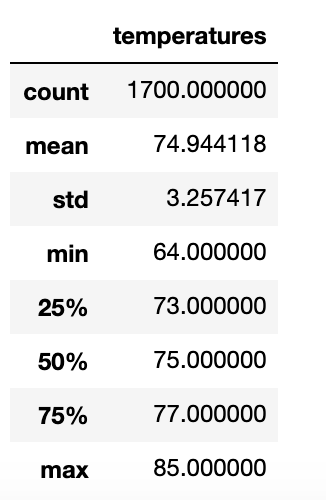
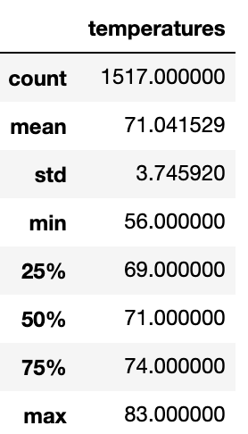

# Surfs Up
Module 9 - Advanced Data Storage and Retrieval

# Overview of the analysis: Explain the purpose of this analysis.
Wave and Icecream buisness  investor W. Avy
W. Avy likes your analysis, but he wants more information about temperature trends before opening the surf shop. Specifically, he wants temperature data for the months of June and December in Oahu, in order to determine if the surf and ice cream shop business is sustainable year-round.

Deliverable 1: Determine the Summary Statistics for June

 [June_statistics.png](June_statistics.png)

 [December_statistics.png](June_statistics.png)

Deliverable 2: Determine the Summary Statistics for December

# Results: Provide a bulleted list with three major points from the two analysis deliverables. Use images as support where needed.
# Summary: Provide a high-level summary of the results and two additional queries that you would perform to gather more weather data for June and December.
